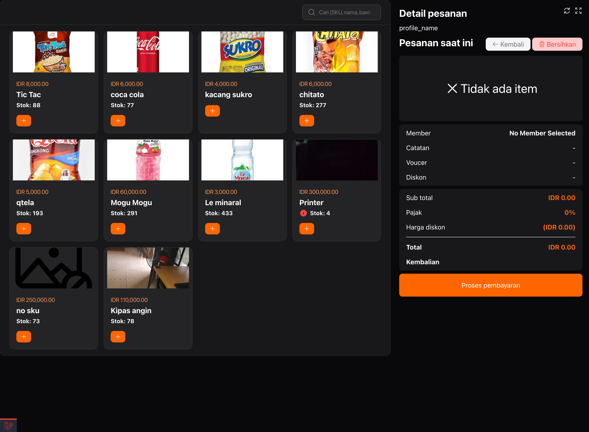
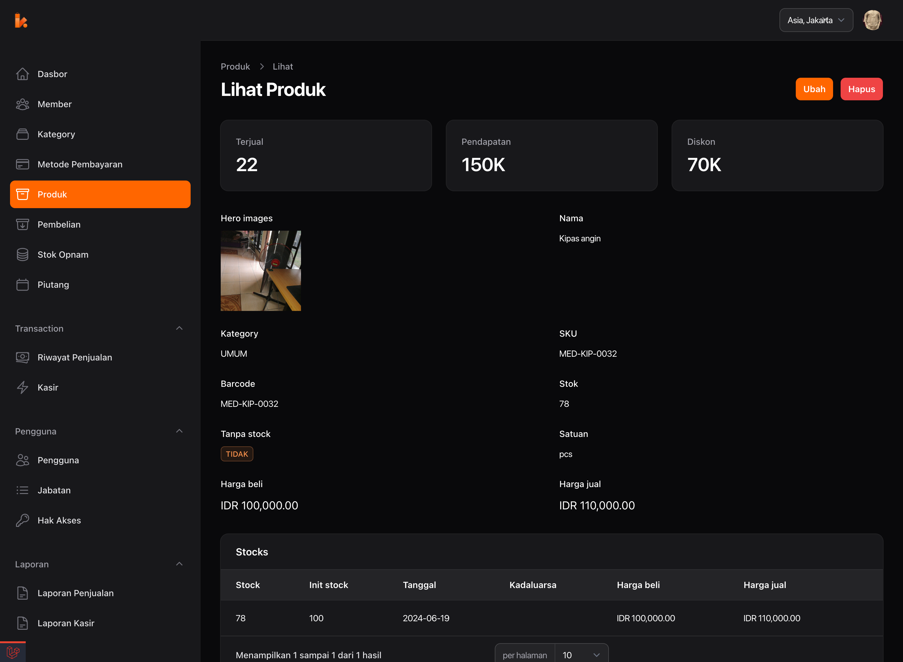

  
  <h1>Lakasir Web App</h1>

  
 Lakasir is a Point of Sale (POS) application built using Laravel for the API, the Filament admin panel for the web application, and Flutter for the mobile application. 

  

## Requirements
* php 8.1
* mysql 5.7 or higher
* php-ext.* base on laravel extenstion requirement

## Features
- **Role Management**: Define roles and permissions for users.
- **Transaction Management**: Handle sales transactions seamlessly.
- **Product Management**: Manage your inventory and products effectively.
- **Unit Price**: The product will have a different price base on the basic unit.
- **Discount**: You can sell the product with a discount per item or global discount.
- **Purchasing**: Manage purchase orders and supplier relationships.
- **Stock Opname**: Conduct stock taking and inventory audits to ensure accuracy.
- **Receivable Management**: Track and manage receivables owed by and to your business.
- **Payment Method Management**: Define and manage various payment methods.
- **Voucher Management**: Create, distribute, and track the usage of vouchers.
- **Reporting**: Generate reports for insights into sales and performance.
- **Simple Accounting**: Basic accounting features to track income, expenses, and profits.
- **Real-time Dashboard**: Monitor business metrics and performance in real-time.
- **Web usb direct printing**: support the thermal printer using usb feature from browser (Chrome, Firefox)
- **Barcode support**: we can use the barcode on stock opname, purchasing, and POS feature

## Screenshots

  
  &emsp;
    

<!--  -->

## Technologies Used
* **Backend**: [Laravel](https://laravel.com)
* **Frontend** (Web): [Filament Admin Panel](https://filamentphp.com)
* **Frontend** (Mobile): [Flutter](https://flutter.github.io)

## Installation
1. Clone the repository: git clone https://github.com/lakasir/lakasir.git
2. Navigate to the project directory: cd lakasir
3. Install dependencies:
4. Nodejs:
   * npm install
   * npm run dev (development)
   * npm run build (production)
5. Laravel:
   * `composer install`
   * `cp .env.example .env`
   * edit the env based on your local configuration
   * `php artisan key:generate`
   * `php artisan migrate --seed`
   * `php artisan filament:assets`
6. Create the user using `php artisan app:create-user`

## Usage
* api: localdomain.test/api/test
* webapp: localdomain.test/member/login

## Extend the features
Lakasir support modularity and extendability, you can easily add new features to the application without changing the core application code.
you can simply look at the [module-plugin](https://github.com/lakasir/lakasir-module)

## Contributing

We welcome contributions from the community! If you'd like to contribute to Lakasir, please follow these steps:

1. keep on eye on [project board](https://github.com/orgs/lakasir/projects/2/views/1)
2. Fork the repository.
3. Create a new branch (git checkout -b feature/new-feature). 
4. Make your changes and commit them (git commit -am 'Add new feature').
5. Push to the branch (git push origin feature/new-feature).
6. Create a new Pull Request.
   
When contributing to this project, please keep an eye on our project features board on GitHub to stay updated with ongoing and planned features.

## License
This project is licensed under the GPL-3.0 license - see the [LICENSE](https://github.com/lakasir/lakasir?tab=GPL-3.0-1-ov-file) file for details.

## Contact
For any inquiries or support, please contact lakasirapp@gmail.com or you can open discussion in discussion features

## Donate for live longer

## Star History

<a href="https://star-history.com/#lakasir/lakasir&Date">
 <picture>
   <source media="(prefers-color-scheme: dark)" srcset="https://api.star-history.com/svg?repos=lakasir/lakasir&type=Date&theme=dark" />
   <source media="(prefers-color-scheme: light)" srcset="https://api.star-history.com/svg?repos=lakasir/lakasir&type=Date" />
   
 </picture>
</a>
